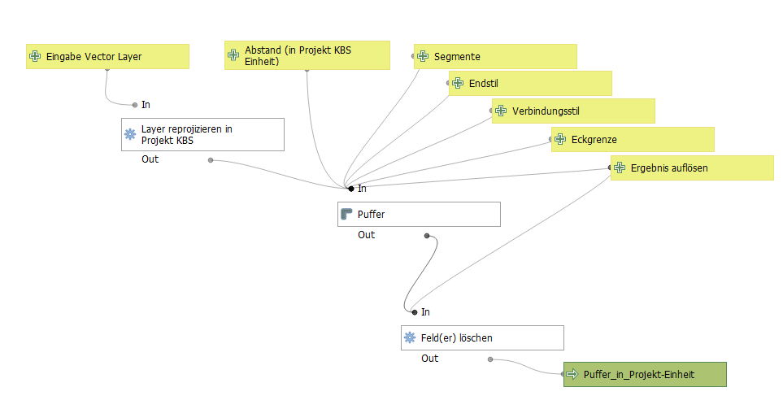

# qgis-models-and-functions
Individuelle Modelle für den QGIS Modeler und Python Funktionen

### Übersicht benötigte Funktionen je Modell
|  Modell | benötigte Funktion(en)  |   
|---|:---:|
| [_analytisch_zusammenfuegen](#_analytisch_zusammenfuegen)  | [_all_fields](functions/_all_fields.py) [_array_difference](functions/_array_difference.py) |   
| [_Centerpoint_Koordinaten_erzeugen](#_Centerpoint_Koordinaten_erzeugen)  | :x:   |   
| [_Join_mit_Rest](#_Join_mit_Rest)  | :x:   | 
| [_Puffer_in_Projekt-Einheit](#_Puffer_in_Projekt-Einheit)  | [_all_fields](functions/_all_fields.py)  | 
| [_zaehle_Kleines_im_Grossen](#_zaehle_Kleines_im_Grossen)  | :x:   | 

### Übersicht Modelle

#### _analytisch_zusammenfuegen

#### _Centerpoint_Koordinaten_erzeugen

#### _Join_mit_Rest

#### _Puffer_in_Projekt-Einheit

#### _zaehle_Kleines_im_Grossen

