# qgis-models-and-scripts
Individuelle Modelle für den [QGIS Modeler](https://docs.qgis.org/latest/de/docs/user_manual/processing/modeler.html), [QGIS Stile](https://docs.qgis.org/latest/de/docs/user_manual/appendices/qgis_file_formats.html?highlight=qml#qml-the-qgis-style-file-format), Python [Skripte](https://docs.qgis.org/latest/de/docs/user_manual/processing/scripts.html) und [Funktionen](https://docs.qgis.org/latest/de/docs/user_manual/working_with_vector/expression.html#function-editor)

### Übersicht Modelle

- [centerpoint_koordinaten_erzeugen](#centerpoint_koordinaten_erzeugen)
- [join_mit_rest](#join_mit_rest)
- [kreisgrenze_viersen](#kreisgrenze_viersen)
- [naechste_adresse_kvie](#naechste_adresse_kvie)
- [osm_editor_url](#osm_editor_url)
- [puffer_in_projekteinheit](#puffer_in_projekteinheit)
- [zaehle_kleines_im_grossen](#zaehle_kleines_im_grossen)
- WFS Daten Kreis Viersen (KVIE)
  - [alle_flurstuecke_kvie](#alle_flurstuecke_kvie)
  - [alle_gebaeude_kvie](#alle_gebaeude_kvie)
  - [alle_navigeb_kvie](#alle_navigeb_kvie)
  - [alle_nutzungsarten_kvie](#alle_nutzungsarten_kvie)
- analytisch zusammenfügen (az)
  - [az_alles_mit_anzahl](#az_alles_mit_anzahl)
  - [az_attribut_mit_anzahl](#az_attribut_mit_anzahl)
  - [az_attribut_beruehrt_mit_anzahl](#az_attribut_beruehrt_mit_anzahl)
  - [az_beruehrt_mit_anzahl](#az_beruehrt_mit_anzahl)

### Grafische Übersichten der Modelle

#### centerpoint_koordinaten_erzeugen

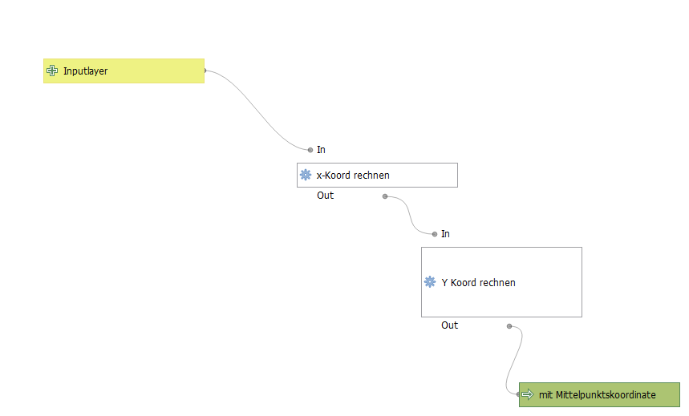

#### join_mit_rest

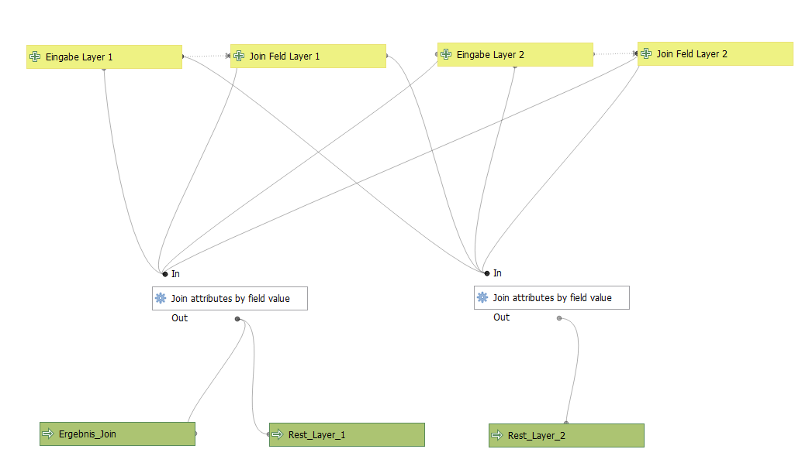

#### kreisgrenze_viersen

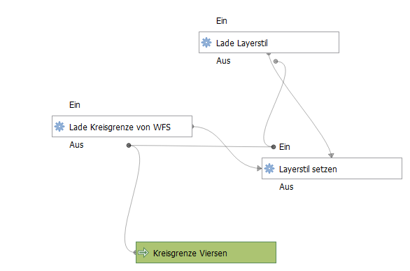

#### naechste_adresse_kvie

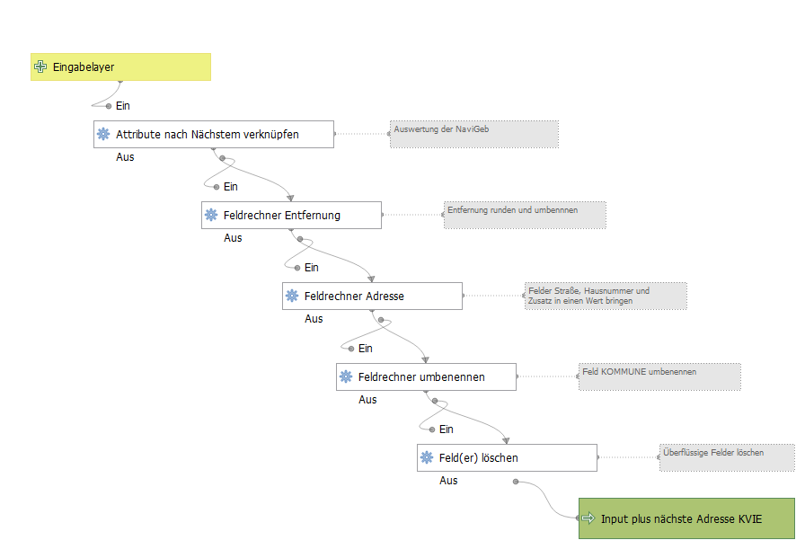

#### osm_editor_url

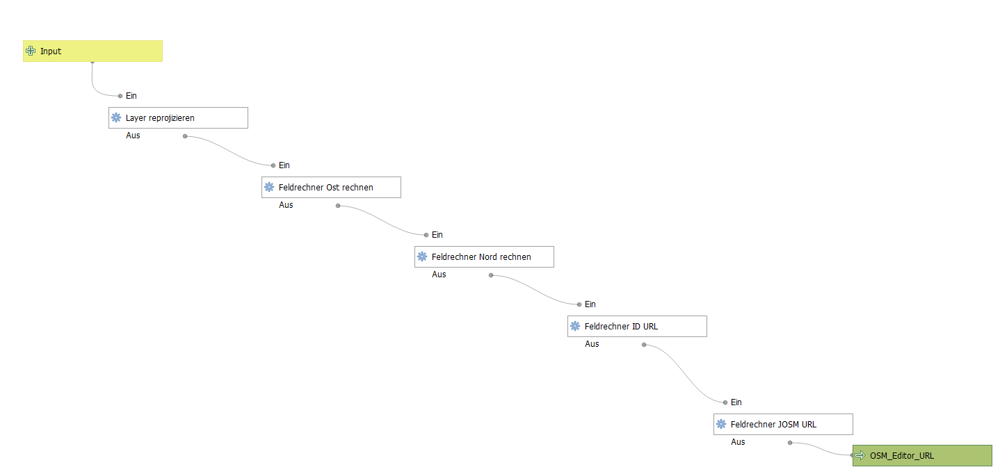

#### puffer_in_projekteinheit

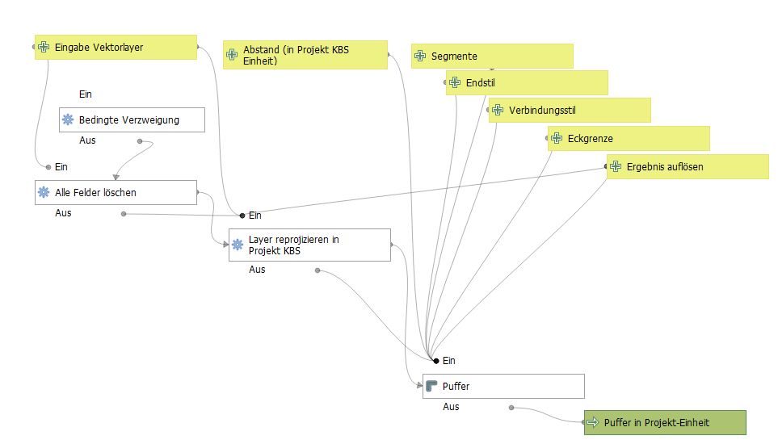

#### zaehle_kleines_im_grossen

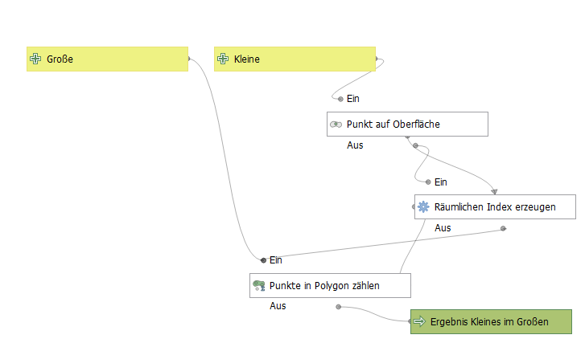

#### alle_flurstuecke_kvie

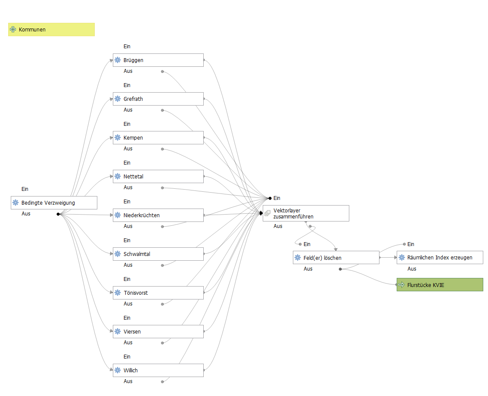

#### alle_gebaeude_kvie

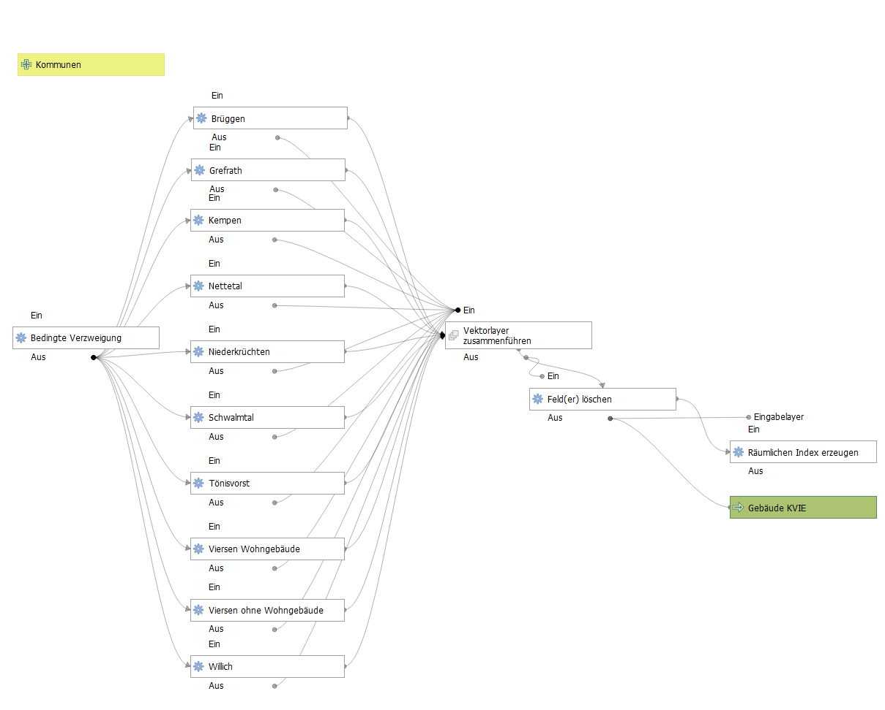

#### alle_navigeb_kvie

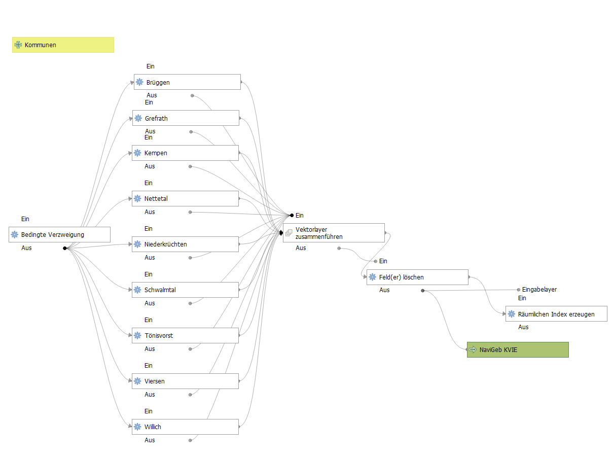

#### alle_nutzungsarten_kvie

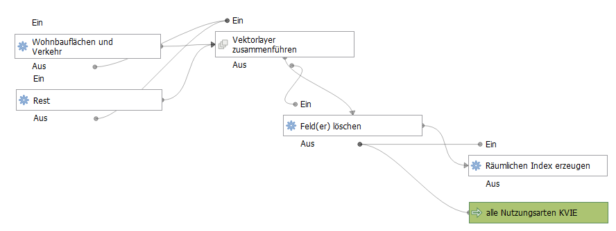

#### az_alles_mit_anzahl

#### az_attribut_mit_anzahl

#### az_attribut_beruehrt_mit_anzahl

#### az_beruehrt_mit_anzahl

