# qgis-models-and-scripts
Individuelle Modelle für den [QGIS Modeler](https://docs.qgis.org/latest/de/docs/user_manual/processing/modeler.html), [QGIS Stile](https://docs.qgis.org/latest/de/docs/user_manual/appendices/qgis_file_formats.html?highlight=qml#qml-the-qgis-style-file-format), Python [Skripte](https://docs.qgis.org/latest/de/docs/user_manual/processing/scripts.html) und [Funktionen](https://docs.qgis.org/latest/de/docs/user_manual/working_with_vector/expression.html#function-editor)

### Übersicht Modelle

- [_Centerpoint_Koordinaten_erzeugen](#_Centerpoint_Koordinaten_erzeugen)
- [_Join_mit_Rest](#_Join_mit_Rest)
- [_kreisgrenze_viersen](#_kreisgrenze_viersen)
- [_osm_editor_url](#_osm_editor_url)
- [_puffer_in_projekteinheit](#_puffer_in_projekteinheit)
- [_zaehle_kleines_im_grossen](#_zaehle_kleines_im_grossen)
- WFS Daten Kreis Viersen (KVIE)
  - [_alle_flurstuecke_kvie](#_alle_flurstuecke_kvie)
  - [_alle_gebaeude_kvie](#_alle_gebaeude_kvie)
  - [_alle_navigeb_kvie](#_alle_navigeb_kvie)
  - [_alle_nutzungsarten_kvie](#_alle_nutzungsarten_kvie)
- analytisch zusammenfügen (az)
  - [az_alles_mit_anzahl](#az_alles_mit_anzahl)
  - [az_attribut_mit_anzahl](#az_attribut_mit_anzahl)
  - [az_attribut_beruehrt_mit_anzahl](#az_attribut_beruehrt_mit_anzahl)
  - [az_beruehrt_mit_anzahl](#az_beruehrt_mit_anzahl)

### Grafische Übersichten der Modelle

#### _Centerpoint_Koordinaten_erzeugen

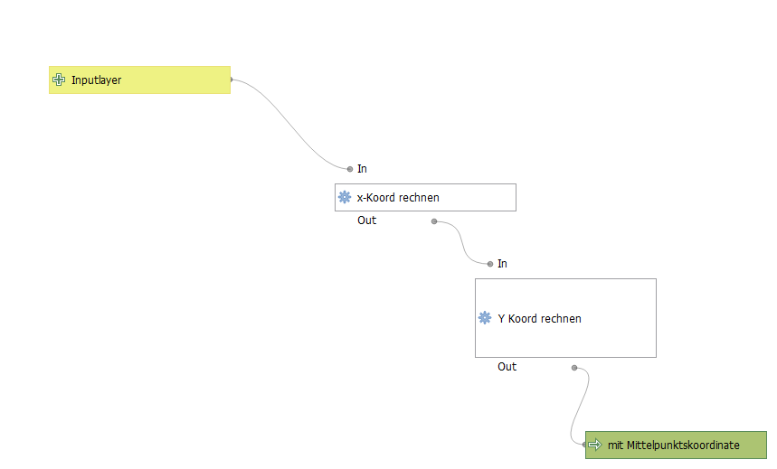

#### _Join_mit_Rest

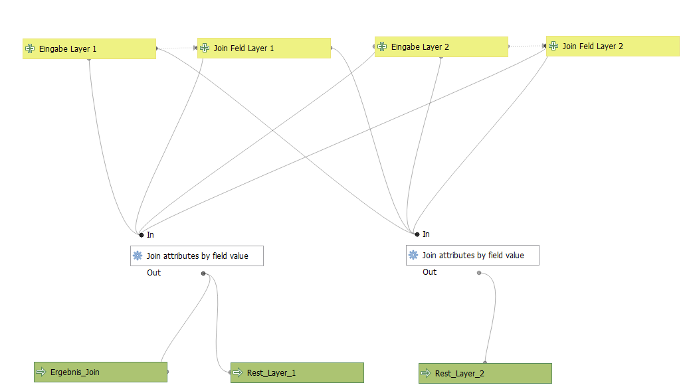

#### _kreisgrenze_viersen

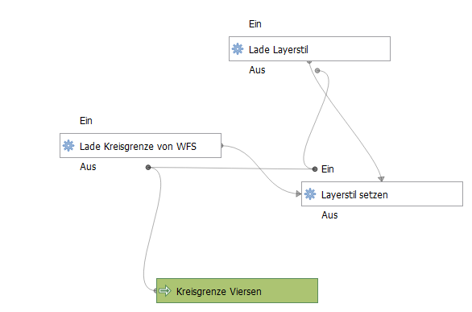

#### _osm_editor_url

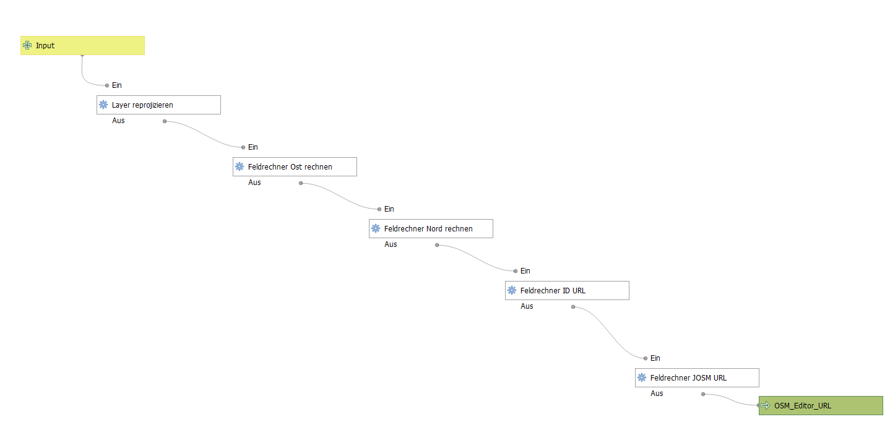

#### _puffer_in_projekteinheit

#### _zaehle_kleines_im_grossen

#### _alle_flurstuecke_kvie

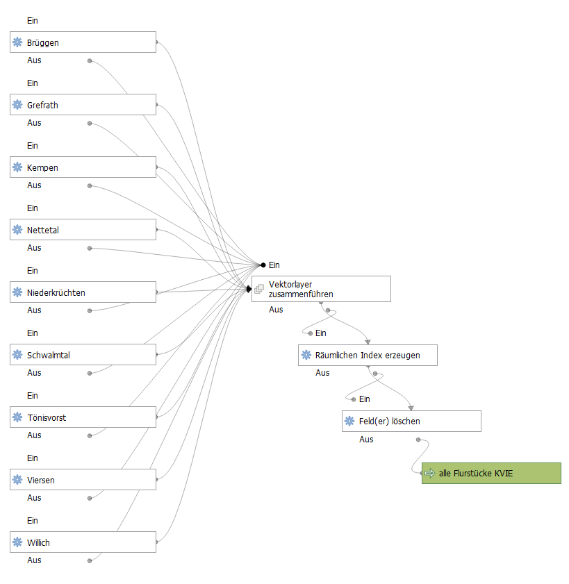

#### _alle_gebaeude_kvie

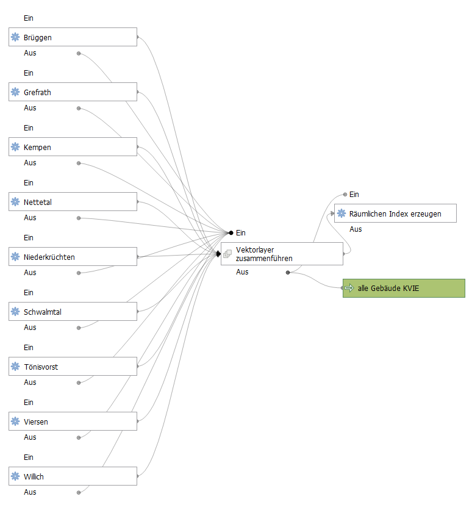

#### _alle_navigeb_kvie

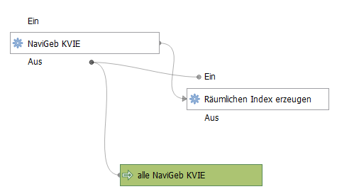

#### _alle_nutzungsarten_kvie

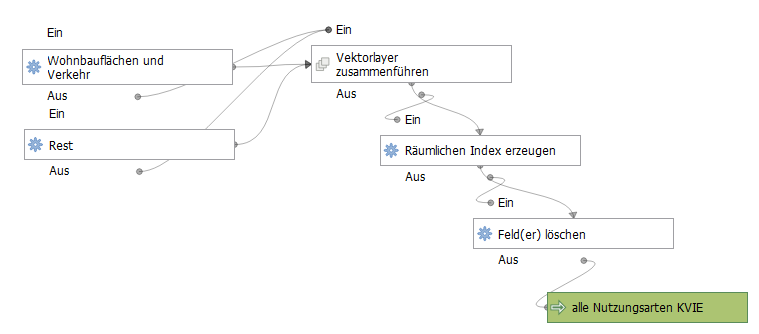

#### az_alles_mit_anzahl

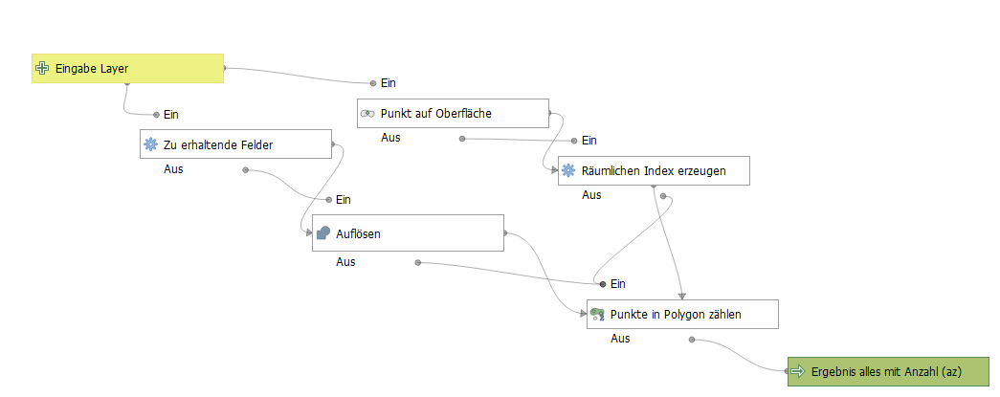

#### az_attribut_mit_anzahl

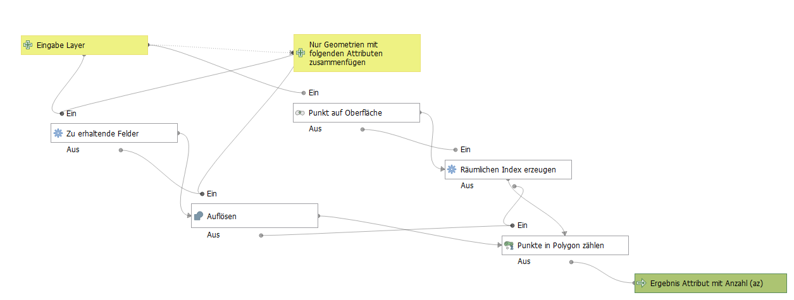

#### az_attribut_beruehrt_mit_anzahl

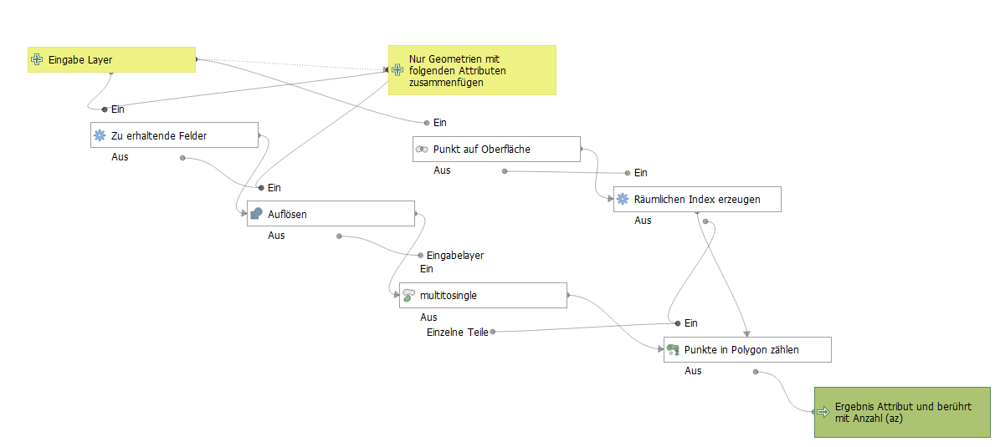

#### az_beruehrt_mit_anzahl

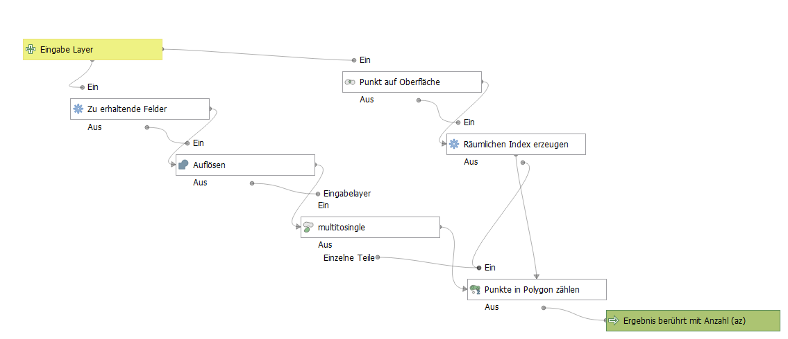
