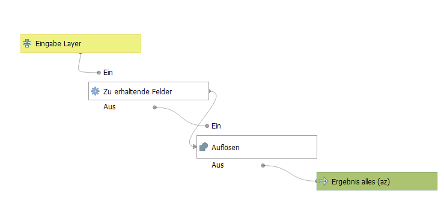
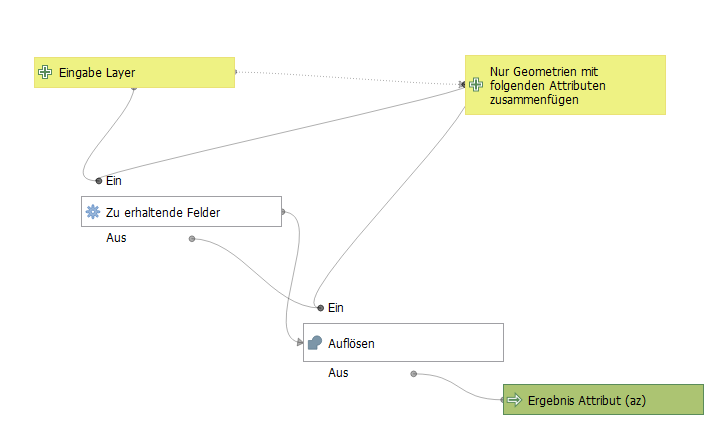
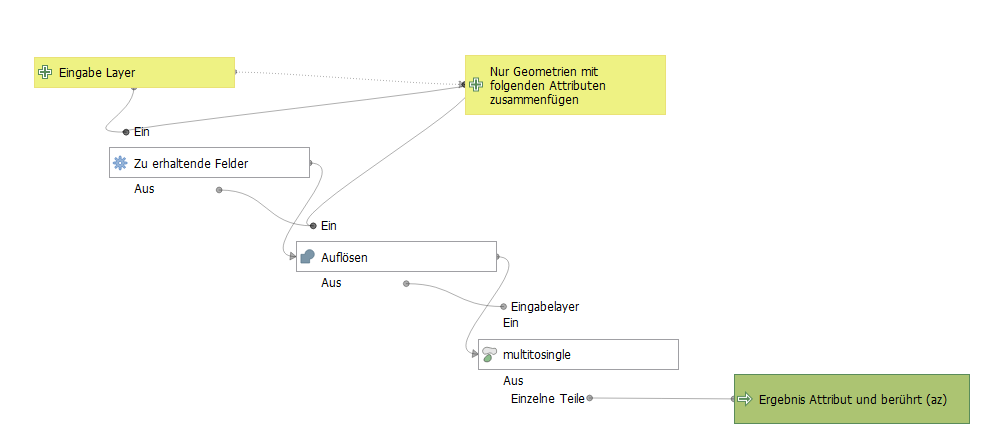
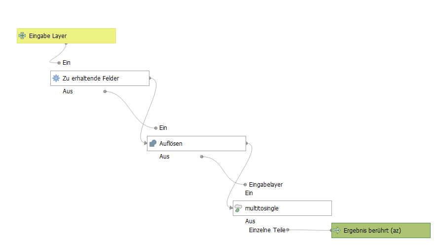

# qgis-models-and-scripts
Individuelle Modelle für den [QGIS Modeler](https://docs.qgis.org/latest/de/docs/user_manual/processing/modeler.html), [QGIS Stile](https://docs.qgis.org/latest/de/docs/user_manual/appendices/qgis_file_formats.html?highlight=qml#qml-the-qgis-style-file-format), Python [Skripte](https://docs.qgis.org/latest/de/docs/user_manual/processing/scripts.html) und [Funktionen](https://docs.qgis.org/latest/de/docs/user_manual/working_with_vector/expression.html#function-editor)

### Übersicht Modelle
| [_Centerpoint_Koordinaten_erzeugen](#_Centerpoint_Koordinaten_erzeugen)  |
| [_Join_mit_Rest](#_Join_mit_Rest)  |
| [_puffer_in_projekt-einheit](#_puffer_in_projekt-einheit)  |
| [_zaehle_kleines_im_grossen](#_zaehle_kleines_im_grossen)  |
| WFS Daten Kreis Viersen (KVIE) |
| [_alle_flurstuecke_kvie](#_alle_flurstuecke_kvie)  |
| [_alle_gebaeude_kvie](#_alle_gebaeude_kvie)  |
| [_alle_navigeb_kvie](#_alle_navigeb_kvie)  |
| [_alle_nutzungsarten_kvie](#_alle_nutzungsarten_kvie)  |
| analytisch zusammenfügen (az) |
| [_az_alles](#_az_alles)  |
| [_az_attribut](#_az_attribut)  |
| [_az_attribut_beruehrt](#_az_attribut_beruehrt)  |
| [_az_beruehrt](#_az_beruehrt)  |

#### _Centerpoint_Koordinaten_erzeugen

#### _Join_mit_Rest

#### _puffer_in_projekt-einheit

#### _zaehle_kleines_im_grossen

#### _alle_flurstuecke_kvie

#### _alle_gebaeude_kvie

#### _alle_navigeb_kvie

#### _alle_nutzungsarten_kvie

#### _az_alles

#### _az_attribut

#### _az_attribut_beruehrt

#### _az_beruehrt

